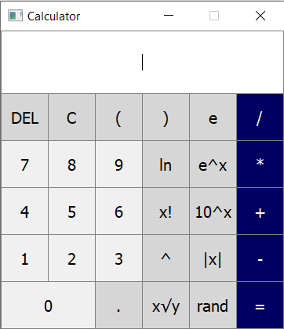

<div align="center">
    <h1>Calculator</h1>
    <p>IVS Project 2</p>
    <p>2020/2021</p>
    <p>
    
    <br>
    </p>
</div>

## About

A simple calculator made in python using buildin math library, buildin functions and Qt for UI.
This software is targeted for **Windows** because it's platfor all of us using but in theory you can use it on whatever
system with graphical interface you want because python can run almost anywhere.

## Getting Started

If you want to play with code yourself clone this repository like this
```
git clone https://github.com/Matesxs/IVS-Projekt-2-Kalkulacka
```

## Setup for developement
```
install python 3.7+
create python venv and activate it (optional)
cd src
pip install -r requirements.txt or make init
```

### Makefile endpoints
```
init - install packages from requirements.txt for developement
all - make tests and run app
run - run app
doc - generate doxygen code documentation
build - build standalone version and installer of app
build_standalone - build only standalone version of app
build_installer - build only installer of app (Inno Setup Compiler required)
clean - clean all files that will not be submitted
test - run tests on app
test_with_coverage - run tests on app with test code coverage
profile - start profiling program with input from console
profile_with_log - start profiling with random data input and output log data (graphviz optional)
pack - create .exe files from app, generate docomentation and pack it to zip for submit
```

## Tools

* [Python](https://www.python.org/)
* [PyQt](https://wiki.python.org/moin/PyQt)

## Authors

Name of team: "Název týmu:"

* **Martin Douša**
* **Ondřej Sláma**
* **Vojtěch Schindler**

## License

This project is licensed under the GNU GPL v.3 License.
